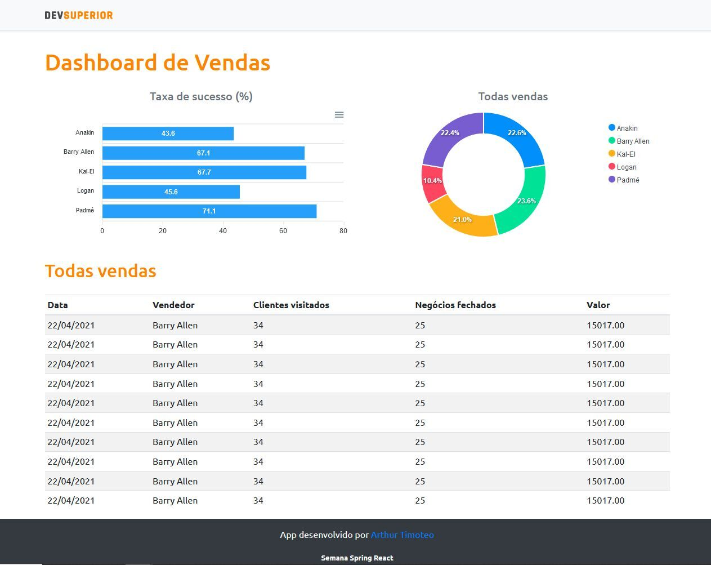

<h1 align="center">Sales analysis dashboard</h1>

  

## Project

Dashboard for sales analysis. We will have a CI / CD to keep the project constantly updated.

## Technologies

This project was developed with the following technologies:

- [ReactJS](https://pt-br.reactjs.org/)
- [Spring Boot](https://spring.io/projects/spring-boot)
- [PostgreSQL 12](https://www.postgresql.org/)
- [Apexcharts](https://apexcharts.com/)

## Conceptual database model

  

## Project structure

  

## How to run

- Create a folder to workspace;
- Access the workspace folder;
- Clone the repository;
- Install the Java 11 in your machine;
- Verify if the Java 11's folder is registered in the System Variables in your machine;
- Install the STS IDE;
- Open the workspace folder in the STS IDE;
- File -> Import -> Maven -> Existing Maven Projects -> Browse.. -> access the cloned project folder and select `backend` folder -> Finish;
- To run back-end in test environment, alter variable APP_PROFILE value to `test` in the file `application.properties`;
- To run back-end in development environment, alter variable APP_PROFILE value to `dev` in the file `application.properties` and alter variables username and password values to your PostgreSQL connection data in the file `application-dev.properties`;
- To run back-end in production environment, alter variable APP_PROFILE value to `prod` in the file `application.properties` and create the environment variable DATABASE_URL in your production environment with the database url;
- Start the back-end via the STS IDE;
- Access the cloned project folder;
- Access `frontend` directory;
- Install dependencies with `yarn`;
- Start the front-end with `yarn start` or `npm start`;

## License

This project is under the MIT license. See the [LICENSE](LICENSE.md) file for more details.